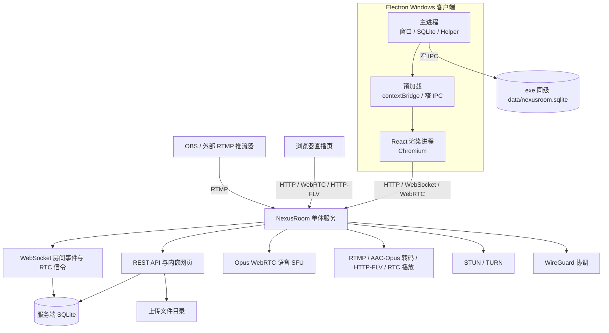
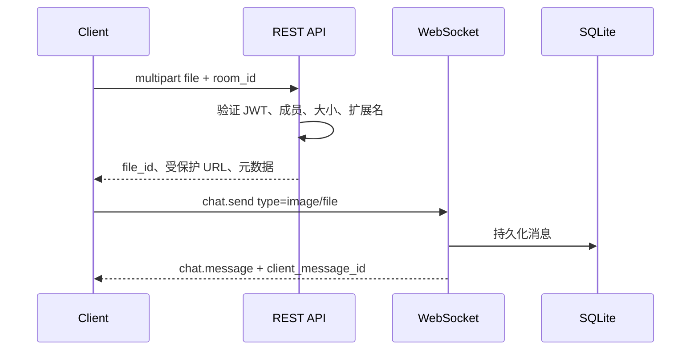
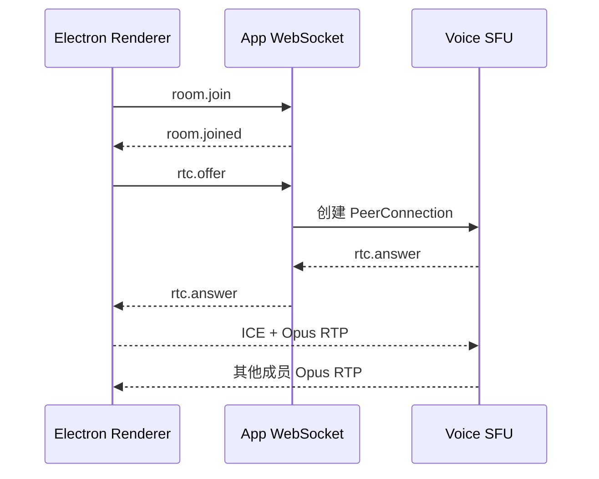

# NexusRoom 技术规范与开发标准

本文档是 NexusRoom `3.0.0` 的架构、协议、数据、开发、部署和质量标准基线。实现事实以当前仓库源码为准；修改对外协议、持久化结构、部署方式或本文标记为“必须”的规则时，代码、测试和文档必须在同一变更中更新。

文档中的“必须”“不得”“应当”和“可以”用于区分强制约束、禁止事项、推荐实践和可选实现。旧版 `1.x` 文档中关于 PostgreSQL、Redis、LiveKit Server、SRS、nginx 多容器编排的内容已经失效，不得作为当前实现依据。

## 1. 项目定位

NexusRoom 是面向小型私有社群的自托管通信平台，目标是使用 Windows Electron 桌面端和一个可独立部署的 Go 服务端提供：

- 服务端账号注册、登录、资料和好友关系 API；当前桌面 UI 使用登录和会话恢复。
- 房间创建、加入、成员管理和在线状态。
- 房间文字、图片和文件消息 API；当前桌面 UI 发送文字和图片。
- 多人 WebRTC 语音。
- OBS 等外部推流器的 RTMP 推流与直播播放。
- 浏览器直播列表和播放器。
- 房间级 WireGuard 虚拟局域网。
- Docker 单容器和 Linux 直接部署。

### 1.1 核心原则

| 原则 | 约束 |
| --- | --- |
| 私有化优先 | 部署者控制服务端、数据库、上传文件和网络边界。 |
| 单体服务端 | 业务所需 API、信令、媒体和状态模块由同一个 NexusRoom 服务管理；内部媒体工作进程不得成为独立服务。 |
| 无外部业务服务 | 不依赖 PostgreSQL、Redis、LiveKit Server、SRS 或 nginx 才能运行。 |
| 源码一体化 | 第三方开源库是编译依赖或实现参考，不是 NexusRoom 之外的业务服务。 |
| 可验证 | 每项关键行为必须有自动化测试或明确的人工验收步骤。 |
| 数据边界明确 | 服务端保存权威业务数据；客户端只保存当前设备需要的设置和离线缓存。 |
| 兼容优先 | 对外 API、WebSocket 和本地数据库变更必须提供迁移或明确的版本边界。 |

### 1.2 当前非目标

- 不提供跨服务端联邦通信。
- 不承诺移动端已经可用；当前桌面客户端目标是 Windows x64 Electron。
- 不在应用进程内部实现 TLS 证书自动签发；生产 TLS 由部署入口负责。
- 不把客户端本地缓存视为服务端权威数据；客户端只缓存当前设备所需的设置、会话和消息。
- 不做 H.264 视频转码；推流编码必须满足浏览器支持范围。

## 2. 系统总览



### 2.1 协议边界

| 客户端 | 服务端入口 | 协议 | 主要用途 |
| --- | --- | --- | --- |
| Electron 渲染进程 | `/api/v1/*` | HTTP/JSON | 登录、房间、消息、图片、推流入口和 VLAN |
| Electron 渲染进程 | `/ws?token=...` | WebSocket/JSON | 房间事件、文字确认、状态和 WebRTC 信令 |
| Electron 渲染进程 | ICE 下发地址 | WebRTC/Opus | 多人语音 |
| Electron 渲染进程 | `/api/v1/stream/:streamKey` | HTTP-FLV | WebRTC 失败后的锁定回退 |
| 浏览器 | `/`、`/player.html` | HTTP | 内嵌直播页面 |
| 浏览器 | `/api/v1/web/rtc/play` | HTTP/SDP | H.264/Opus WebRTC 播放协商 |
| OBS 或其他推流器 | `/live/{streamKey}` | RTMP | H.264 和可选 AAC 发布 |
| Windows WireGuard Helper | WireGuard 端点 | UDP | 房间虚拟局域网 |

## 3. 仓库与文档结构

```text
Nexusroom/
├── client/                      Electron + React + TypeScript 客户端源码
├── server/                      Go 单体服务端源码
├── deployment/                  Docker、systemd、脚本和配置模板
├── docs/
│   ├── README.md                文档索引
│   ├── NexusRoom.md             本技术规范，唯一完整技术基线
│   ├── build/                   客户端和服务端构建文档
│   └── guides/                  客户端、服务端和部署指南
├── README.md                    开源仓库入口
├── CHANGELOG.md                 发布历史
├── CONTRIBUTING.md              贡献流程
├── CODE_OF_CONDUCT.md           行为准则
├── SECURITY.md                  安全报告策略
└── LICENSE                      MIT License
```

### 3.1 文档归属规则

- 完整技术事实只在本文件维护。
- 操作型说明放入 `docs/guides/`，构建型说明放入 `docs/build/`。
- `client/README.md`、`server/README.md` 和 `deployment/README.md` 只作为源码目录入口，不复制长篇规范。
- 根目录开源治理文件保持在根目录，确保 GitHub 等平台能够自动识别。

## 4. 服务端架构

### 4.1 模块职责

| 模块 | 源码路径 | 职责 |
| --- | --- | --- |
| 进程装配 | `server/cmd/server` | 加载配置、初始化模块、监听端口、清理任务和优雅关闭 |
| HTTP/API | `server/internal/api` | Gin 路由、中间件、Handler、静态资源 |
| 配置 | `server/internal/config` | YAML 配置模型、默认值和全局配置 |
| 数据库 | `server/internal/database` | SQLite 连接、AutoMigrate、完整性检查 |
| 模型 | `server/internal/model` | GORM 持久化实体 |
| 仓库 | `server/internal/repository` | 数据查询、事务和业务数据访问 |
| WebSocket | `server/internal/ws` | 连接、房间订阅、事件广播、聊天和 RTC 信令 |
| 语音 | `server/internal/media/voice` | Pion PeerConnection、Opus RTP 接收和房间转发 |
| RTMP | `server/internal/media/rtmp` | RTMP 发布、Stream Key 校验和媒体读取 |
| 流注册表 | `server/internal/media/stream` | 活跃流、订阅者、关键帧和统计 |
| FLV | `server/internal/media/flv` | H.264/AAC 到 HTTP-FLV 封装 |
| 音频转码 | `server/internal/media/audiotranscode` | 每路活动 AAC 源共享的 FFmpeg Opus RTP 转码 |
| RTC 播放 | `server/internal/media/rtcplay` | H.264/Opus 浏览器 WebRTC 播放 |
| TURN | `server/internal/media/turnserver` | STUN/TURN UDP 服务和中继端口管理 |
| 公网地址 | `server/internal/network/publicip` | 公网 IPv4 自动发现、手动覆盖和周期刷新 |
| WireGuard | `server/internal/wg` | 接口、密钥、地址池和 Peer 生命周期 |
| 网页 | `server/web` | 通过 Go embed 编译进二进制的直播页面和脚本 |

### 4.2 启动顺序

1. 从当前工作目录读取 `config.yaml`。
2. 打开 SQLite，启用 WAL、外键、busy timeout 和 `NORMAL` 同步模式。
3. 执行 GORM AutoMigrate、完整性检查和外键检查。
4. 创建用户、房间、消息、推流、好友和 WireGuard 仓库。
5. 初始化 WireGuard；失败时记录日志并降级为数据库协调模式。
6. 读取手动公网 IPv4，或通过本机接口和 STUN 完成首次自动发现并启动周期刷新。
7. 启动内建 TURN，并按当前公网 IPv4 构造下发给客户端的 ICE Server 列表。
8. 初始化语音 SFU 和 WebSocket Hub。
9. 初始化活跃流注册表、浏览器 RTC 播放和 RTMP 接入。
10. 启动 HTTP 服务和每日消息清理任务。
11. 收到 `SIGINT`、`SIGTERM` 或核心监听错误后进入关闭流程。

### 4.3 关闭顺序

- 取消应用上下文，阻止后台任务继续运行。
- 停止 RTMP 接入。
- 在 5 秒超时内关闭 HTTP 服务。
- 释放语音、TURN、WireGuard 和数据库资源。
- 新增长生命周期资源时，必须同时接入关闭路径并保证重复调用安全。

## 5. 数据设计

### 5.1 服务端 SQLite

默认路径为 `./data/nexusroom.db`。连接参数：

| 参数 | 当前值 | 目的 |
| --- | --- | --- |
| Journal Mode | WAL | 允许读取与单写入并行 |
| Busy Timeout | 5000 ms | 为短时写冲突提供等待窗口 |
| Foreign Keys | on | 启用外键一致性 |
| Synchronous | NORMAL | 在可靠性和写入性能之间取平衡 |
| Max Open Connections | 4 | 限制 SQLite 并发连接数 |

启动必须通过 `PRAGMA integrity_check` 和 `pragma_foreign_key_check`。检查失败时服务不得继续启动。

### 5.2 服务端表

| 表 | 主键/唯一键 | 关键字段 | 说明 |
| --- | --- | --- | --- |
| `users` | `id`；`username`、`user_display_id` 唯一 | nickname、password_hash、avatar_url、role、is_active、last_login_at | 用户和权限 |
| `rooms` | `id`；room_code、invite_code、media_room_name 唯一 | name、owner_id、created_at | 房间主体 |
| `room_members` | room_id + user_id | role、joined_at | 房间成员关系 |
| `messages` | 自增 id | room_id、sender_id、type、content、meta、created_at | 权威聊天记录 |
| `room_ingresses` | id；ingress_id、stream_key 唯一 | room_id、rtmp_url、label、is_active、created_by | 推流入口 |
| `friendships` | requester_id + addressee_id | status、created_at、updated_at | 好友申请和关系 |
| `wg_peers` | id | room_id、user_id、public_key、assigned_ip、last_handshake_at | VLAN Peer |

消息 `type` 当前支持 `text`、`image`、`file` 和 `system`。扩展元数据以 JSON 文本保存。新增消息类型必须同时更新服务端校验、客户端模型、渲染、测试和本文档。

### 5.3 客户端 SQLite

目标路径固定为：

```text
NexusRoom.exe
data/
├── nexusroom.sqlite
├── nexusroom.sqlite-wal    运行期间可能存在
└── nexusroom.sqlite-shm    运行期间可能存在
```

客户端数据库包含：

| 表 | 主键 | 主要内容 |
| --- | --- | --- |
| `settings` | key | 服务器 URL、账号 ID、展示 ID 和主题 |
| `account_sessions` | server_url + account_id | 按服务器和账号隔离的登录令牌 |
| `messages` | server_url + account_id + id | 房间消息离线缓存和发送回显 |

本地消息必须同时按服务器 URL 和账号 ID 隔离。任何消息查询、增量锚点、房间清理或 WebSocket 写入遗漏账号 ID，均视为数据隔离缺陷。

客户端只读取可执行文件同级的 `data` 目录，不扫描或导入其他系统目录中的数据库。复制本地状态时应先关闭客户端，并把 SQLite 主文件、WAL 和 SHM 作为一个整体处理。

“清除本地数据”必须在全局数据库连接保持打开时事务性清空设置、会话和消息表，随后执行数据库压缩。不得递归删除 `data` 目录、不得关闭仍被渲染进程引用的数据库、不得使用强制退出掩盖生命周期错误。当前没有旧数据库迁移逻辑；无法识别的 SQLite `user_version` 会安全失败并要求建立新数据库。

### 5.4 数据权威性

- 服务端 SQLite 是账号、房间、成员、好友、推流入口和聊天记录的权威来源。
- 客户端 SQLite 是设置与缓存，允许从服务端重新同步。
- 在线状态、说话状态和活跃直播属于运行时状态，不应仅依赖数据库字段判断。
- 文件二进制保存在服务端上传目录，消息只保存受保护的文件标识、URL和元数据。

## 6. HTTP API 规范

### 6.1 基础约定

- API 前缀：`/api/v1`。
- JSON 字段使用 `snake_case`。
- 时间使用 ISO 8601/RFC 3339 UTC。
- 受保护接口使用 `Authorization: Bearer <JWT>`。
- JWT 使用 HS256，包含 user_id、username、role、签发和过期时间。
- 密码使用 bcrypt，当前 cost 为 12。
- 分页 limit 最大为 100，消息默认 50。

统一响应：

```json
{
  "code": 20000,
  "message": "ok",
  "data": {}
}
```

错误码到 HTTP 状态映射：

| 业务码范围 | HTTP | 含义 |
| --- | --- | --- |
| 20000 | 200 | 成功 |
| 40001-40099 | 400 | 参数错误 |
| 40101-40299 | 401 | 未认证或令牌失效 |
| 40301-40399 | 403 | 权限不足 |
| 40401-40899 | 404 | 资源不存在 |
| 40901-49999 | 409 | 状态或资源冲突 |
| 50001 及以上 | 500 | 服务端错误 |

### 6.2 路由清单

| 方法 | 路径 | 权限 | 用途 |
| --- | --- | --- | --- |
| GET | `/ping` | 公开 | 健康检查和版本，当前返回 `3.0.0` |
| POST | `/api/v1/auth/register` | 公开 | 注册；可带 admin_token 创建超管 |
| POST | `/api/v1/auth/login` | 公开 | 登录并签发 JWT |
| GET | `/api/v1/users/me` | 登录 | 当前用户资料 |
| PATCH | `/api/v1/users/me` | 登录 | 修改昵称等资料 |
| POST | `/api/v1/users/me/avatar` | 登录 | 上传头像 |
| GET | `/api/v1/users/search?display_id=` | 登录 | 按展示 ID 搜索用户 |
| POST | `/api/v1/rooms` | 登录 | 创建房间 |
| POST | `/api/v1/rooms/join` | 登录 | 通过 6 位邀请码加入 |
| GET | `/api/v1/rooms` | 登录 | 当前用户房间列表 |
| GET | `/api/v1/rooms/:roomId` | 房间成员 | 房间详情、成员和推流入口 |
| PATCH | `/api/v1/rooms/:roomId` | 房主/超管 | 修改房间 |
| DELETE | `/api/v1/rooms/:roomId` | 房主/超管 | 解散房间 |
| DELETE | `/api/v1/rooms/:roomId/leave` | 房间成员 | 主动退出；房主必须先解散 |
| DELETE | `/api/v1/rooms/:roomId/members/:userId` | 房主/超管 | 踢出成员 |
| GET | `/api/v1/rooms/:roomId/online-users` | 房间成员 | 当前在线用户 ID |
| GET | `/api/v1/rooms/:roomId/messages` | 房间成员 | 最新、向前或增量消息 |
| POST | `/api/v1/rooms/:roomId/ingresses` | 房间成员/超管 | 创建推流入口 |
| GET | `/api/v1/rooms/:roomId/ingresses` | 房间成员/超管 | 推流入口和实时状态 |
| DELETE | `/api/v1/rooms/:roomId/ingresses/:ingressId` | 房间成员/超管 | 删除非活跃入口 |
| POST | `/api/v1/rooms/:roomId/vlan/join` | 房间成员 | 注册 WireGuard 公钥 |
| DELETE | `/api/v1/rooms/:roomId/vlan/leave` | 登录 | 注销 Peer |
| GET | `/api/v1/rooms/:roomId/vlan/peers` | 房间成员 | Peer 列表 |
| GET | `/api/v1/friends` | 登录 | 好友列表 |
| GET | `/api/v1/friends/pending` | 登录 | 待处理申请 |
| POST | `/api/v1/friends/request` | 登录 | 发起好友申请 |
| PATCH | `/api/v1/friends/request/:requestId` | 接收者 | accept 或 reject |
| POST | `/api/v1/files/upload` | 房间成员 | multipart 上传房间文件 |
| GET | `/api/v1/files/:fileId` | 房间成员 | 下载；支持 Header 或 query token |
| GET | `/api/v1/admin/users` | 超管 | 用户分页 |
| PATCH | `/api/v1/admin/users/:userId` | 超管 | 启用或禁用用户 |
| GET | `/api/v1/admin/rooms` | 超管 | 房间分页 |
| DELETE | `/api/v1/admin/rooms/:roomId` | 超管 | 解散房间 |
| GET | `/api/v1/admin/config` | 超管 | 可管理配置 |
| PATCH | `/api/v1/admin/config` | 超管 | 更新配置 |
| GET | `/api/v1/admin/stats` | 超管 | 统计信息 |
| POST | `/api/v1/webhook/qq` | Bearer admin_token | 写入 QQ 系统消息 |
| GET | `/api/v1/stream/:streamKey` | 公开 | HTTP-FLV 输出 |
| GET | `/api/v1/web/rooms/live` | 公开 | 浏览器活跃直播列表 |
| POST | `/api/v1/web/rtc/play` | 公开 | 浏览器播放 SDP 协商 |

这张表是服务端完整 API 清单。当前 Electron UI 只调用登录、房间、消息、图片、直播入口和 VLAN 相关路径；注册、好友、任意文件、资料、管理员和 Webhook 仍是服务端或集成者接口。

### 6.3 关键请求

注册：

```json
{
  "username": "alice",
  "password": "minimum-six-characters",
  "nickname": "Alice",
  "admin_token": ""
}
```

用户名为 3-32 位字母数字，密码为 6-128 位，昵称为 1-64 字符。`admin_token` 为空时创建普通用户。

创建和加入房间：

```json
{ "name": "Game Room" }
```

```json
{ "invite_code": "ABC123" }
```

消息历史查询：

```text
GET /api/v1/rooms/7/messages?after_id=120&limit=50
GET /api/v1/rooms/7/messages?before_id=80&limit=50
```

上传文件采用 `multipart/form-data`，字段为 `room_id` 和 `file`。服务端限制配置大小和扩展名白名单；下载时根据 file ID 中的房间 ID 再次验证成员身份。

## 7. WebSocket 协议

### 7.1 连接与信封

```text
ws://SERVER/ws?token=JWT
wss://SERVER/ws?token=JWT
```

统一 Envelope：

```json
{
  "event": "chat.send",
  "room_id": 7,
  "payload": {},
  "timestamp": "2026-07-17T00:00:00Z"
}
```

连接成功后服务端发送 `connected`，其中包含 user_id、`server_version: "3.0.0"` 和 RTC ICE Server 列表。客户端必须在收到该事件后再恢复房间订阅。

### 7.2 客户端事件

| 事件 | 关键字段 | 用途 |
| --- | --- | --- |
| `heartbeat` | 无 | 心跳，服务端返回 pong |
| `room.join` | room_id | 订阅房间事件 |
| `room.leave` | room_id | 取消房间订阅 |
| `chat.send` | room_id、type、content、meta、client_message_id | 发送并持久化消息 |
| `voice.mute` | room_id、muted | 同步静音状态 |
| `rtc.offer` | room_id、SDP | 创建/重协商语音 PeerConnection |
| `rtc.answer` | room_id、SDP | RTC 应答 |
| `rtc.ice` | room_id、candidate | ICE Candidate |
| `rtc.leave` | room_id | 释放语音资源 |
| `rtc.speaking` | room_id、speaking | 同步说话状态 |

### 7.3 服务端事件

| 事件 | 用途 |
| --- | --- |
| `connected` | 握手、版本和 ICE 配置 |
| `pong` | 心跳响应 |
| `room.joined` / `room.join_error` | 房间订阅确认或失败 |
| `chat.message` / `chat.error` | 消息成功回显或拒绝 |
| `room.member_join` / `room.member_leave` | 成员实时状态 |
| `room.kicked` / `room.disbanded` | 强制离房或解散 |
| `voice.state_update` | muted 和 speaking 状态 |
| `rtc.answer` / `rtc.ice` / `rtc.error` | RTC 信令结果 |
| `friend.request` / `friend.accepted` | 好友通知 |
| `room.ingress_update` | 推流入口创建、删除和状态变化 |
| `vlan.peer_update` | Peer 加入或离开 |

### 7.4 消息确认规则

1. 客户端发送 `room.join`。
2. 收到 `room.joined` 后才允许发送消息。
3. 每次发送生成唯一 `client_message_id`。
4. 服务端验证成员身份、类型和内容，先写入数据库，再广播 `chat.message`。
5. 客户端以回显的 `client_message_id` 将待发送消息标记成功。
6. 验证或持久化失败时服务端返回 `chat.error`，客户端必须恢复输入状态并显示原因。

不得在服务端确认前伪装成已成功发送，也不得仅依赖本地临时消息作为最终记录。

## 8. 即时消息与文件

### 8.1 文本消息

文本通过 WebSocket 发送，服务端保存后广播。客户端进入房间时使用本地最大消息 ID 调用 `after_id` 增量同步；首次进入或缓存为空时读取最新页。

### 8.2 图片与文件



允许扩展名当前包括图片、常见音视频、PDF、Office 文档、文本和 ZIP。文件名必须由服务端生成，不能直接使用用户路径。生产安全标准要求继续增强 magic bytes 与 MIME 白名单校验，不能只信任扩展名。

## 9. 语音系统

### 9.1 架构

语音使用 Pion WebRTC 构建内建 Opus SFU。应用 WebSocket 承担 SDP/ICE 信令，媒体 RTP 走 WebRTC UDP 或 TURN。客户端不申请 LiveKit Token，也不连接外部 SFU。



### 9.2 麦克风状态标准

- 进入房间后先建立 RTC/ICE，默认保持静音。
- 开麦按钮只有在实际连接可用时才能进入成功状态。
- 连接断开时点击开麦，应触发重连；重连失败必须显示错误并恢复按钮。
- 切换房间时立即停止旧房间媒体并重置静音状态，不能等待长超时后才更新 UI。
- 当前 UI 不提供音频设备选择；浏览器权限允许后使用默认输入设备建立本地轨道。
- 窗口关闭时媒体释放必须有上限，不能无限等待原生进程或浏览器对象。

### 9.3 在线和语音活动指示

- 成员在当前房间内：8 px 绿色中心点常亮。
- 成员不在当前房间内：使用暗色离线点。
- 在线但没有语言输入：绿色中心点保持常亮，不播放动画。
- 检测到语言输入：中心点仍保持常亮，只有外围绿色光晕周期性扩散和淡出。
- 语音检测采用进入阈值 `0.018`、退出阈值 `0.008` 和连续 5 个静音样本保持；采样周期约 200 ms。
- 短暂停顿不得导致动画反复销毁和重启；不同房间的说话状态不得串联。

## 10. 直播系统

### 10.1 推流地址

标准发布地址：

```text
rtmp://SERVER:1935/live/STREAM_KEY
```

服务端创建推流入口时返回：

- `rtmp_url`：规范化服务器地址，例如 `rtmp://example.com:1935/live`。
- `stream_key`：随机推流密钥。
- `publish_url`：可直接交给 OBS 或其他外部 RTMP 推流器的完整地址。

地址推导优先级为 `server.domain`、`media.public_ip`、`X-Forwarded-Host`、请求 Host，最终回退 `127.0.0.1`。实现必须去除 HTTP scheme、重复端口、方括号和多余路径后再生成 RTMP URL。

### 10.2 媒体链路

```text
OBS / 外部 RTMP 推流器
  -> 内建 RTMP Server
  -> Stream Key 校验
  -> 活跃流 Registry
     -> WebRTC -> Electron 播放器优先
     -> HTTP-FLV -> Electron/浏览器回退
     -> H.264 原样转发 + AAC 到 Opus 共享转码
        -> WebRTC -> 浏览器优先播放
```

同一 Stream Key 不允许重复发布。正式入口的推流开始和结束直接更新入口状态并广播 `room.ingress_update`，不依赖外部 SRS 回调。

服务端默认接受合法但未登记到 `room_ingresses` 的 Stream Key。临时 Stream Key 必须为 8-128 位，只能包含 ASCII 字母、数字、连字符和下划线。临时流不写入 SQLite、不绑定房间，只在活跃期间以 `virtual` 类型显示于网页直播大厅；发布连接断开后从 Registry 和网页列表自动移除。将 `media.rtmp.allow_temporary_streams` 设为 `false` 并重启服务，可以关闭这个能力。

### 10.3 编码和播放约束

- RTMP 视频使用 H.264。
- RTMP 可携带 AAC；Electron 和浏览器的 HTTP-FLV 播放器可以播放相应音视频。
- Electron 和浏览器都必须优先使用 WebRTC 同时播放 H.264 视频和 Opus 音频。只有协商、连接、视频首帧或预期音频轨道失败时才回退 HTTP-FLV。
- HTTP-FLV 接管当前页面播放会话后必须保持回退锁。FLV 中断只允许重建 FLV 播放器并使用有上限的退避重试，不得自动重新尝试 WebRTC，也不得在两种协议之间无限循环。
- 网页默认不静音。浏览器阻止有声自动播放时必须保留 WebRTC 会话并等待用户交互，不能把自动播放策略误判为媒体失败。
- 每路带 AAC 的活动源只允许启动一个服务端 FFmpeg 转码工作进程。所有观看者共享输出的 Opus RTP，不得按观看者重复转码。
- 音频转码使用 48 kHz Opus、20 ms 帧和低延迟模式。H.264 视频不得转码，避免额外的视频编码负载和帧级延迟。
- WebRTC 播放必须根据源流 SPS 匹配常见 H.264 Baseline、Main 和 High Profile，不能把所有源流固定声明为同一 Profile。
- 当前 Electron UI 不提供屏幕采集或客户端 FFmpeg 推流；OBS 等外部推流器仍可使用标准 RTMP 地址。
- 删除推流入口前必须确认对应流不活跃。

## 11. VLAN 与 WireGuard

服务端协调房间 Peer、公钥、虚拟 IP 和 WireGuard 接口；Windows Electron 客户端通过与 `NexusRoom.exe` 同级的 `nexusroom-wg.exe` 和 `wintun.dll` 建立本地隧道，Helper 启动可能触发 UAC。

加入流程：

1. 客户端 Helper 生成或加载密钥对。
2. 客户端向 `/api/v1/rooms/:roomId/vlan/join` 提交公钥。
3. 服务端验证房间成员并分配子网内地址。
4. 服务端返回自身公钥、端点、DNS 和其他 Peer。
5. 客户端应用配置，服务端广播 `vlan.peer_update`。
6. 离房、退出或 WebSocket 超时后清理 Peer。

默认子网为 `10.0.8.0/24`，网关为 `10.0.8.1`，监听端口为 `51820/udp`。部署前必须确认该网段不与物理网络、容器网络或其他 VPN 冲突。

WireGuard 初始化失败时服务端会保留数据库协调能力并记录降级日志，但真实网络隧道不可用。UI 必须区分“登记成功”和“隧道实际建立”。

## 12. 客户端架构与 UI

### 12.1 技术栈

| 能力 | 实现 |
| --- | --- |
| 桌面容器 | Electron 39 / Chromium |
| UI | React 19 |
| 语言 | TypeScript 5 |
| 渲染构建 | Vite 6 |
| 测试 | Vitest 3 |
| 代码检查 | ESLint 9 + typescript-eslint |
| HTTP | Fetch 封装的 REST client |
| WebSocket | 项目内 JSON WebSocket client |
| 本地数据库 | Electron Node SQLite API + SQLite |
| 语音 | 浏览器 WebRTC API + 服务端信令 |
| 直播 | WebRTC 优先，mpegts.js HTTP-FLV 回退 |
| 屏幕推流 | 当前 UI 不提供 |
| VLAN | WireGuard Helper + Wintun |
| 窗口 | Electron BrowserWindow |

### 12.2 分层

- `src/main.ts` 与 `src/main/` 中的 IPC、controller、database 模块：主进程窗口生命周期、SQLite、权限和 WireGuard Helper 控制；同目录的 `rest-client.ts`、`ws-client.ts` 是浏览器安全网络模块，由 Vite 打入 renderer，不在主进程执行。
- `src/preload.ts`：通过 `contextBridge` 暴露固定的存储和 WireGuard IPC，不暴露 Node 或任意 `ipcRenderer`。
- `src/renderer/`：React `App`、房间与消息页面、语音、直播和 VLAN 交互；网络请求通过 `NexusRoomClient` 完成。
- `src/shared/`：预加载 API、IPC channel、账号 scope、消息缓存和 WireGuard 配置类型。
- `tests/`：Vitest 单元、集成和 React 组件测试。
- 跨页面状态使用 React hooks 和客户端事件订阅；短生命周期表单和动画状态使用组件局部 state。
- 渲染进程不得导入 `node:*` 或直接拼接裸 HTTP 请求；本地文件、数据库和 Helper 操作必须经过预加载窄 IPC。

当前 Electron UI 的实现范围是：填写服务器地址和账号密码登录、恢复会话；查看房间列表、创建、邀请码加入、退出和切换；加载历史与实时文字；上传图片并使用会话鉴权的 Blob 显示；加入 WebRTC 语音、静音并显示成员在线和说话状态；管理直播入口并优先 WebRTC 播放，失败后锁定 HTTP-FLV 直到刷新；启用 WireGuard VLAN。服务端虽然有注册、好友、任意文件和管理 API，桌面 UI 当前没有这些页面，也没有屏幕采集、音频设备选择或客户端 FFmpeg 推流功能。

### 12.3 UI 结构

客户端保留四个基本分区：

1. 自定义标题栏和窗口控制。
2. 左侧导航与房间入口。
3. 中央工作内容。
4. 房间右侧成员和状态面板。

界面组件、排版、间距、动画和交互状态由 React 组件和共享 CSS token 实现。当前 UI 只声明登录、房间、消息、语音、直播和 VLAN 的已实现状态。

### 12.4 主题标准

- 暗色主题以黑和中性灰为背景，亮色主题以白和中性灰为背景。
- 颜色必须来自 `.app-shell` 的 CSS custom properties，并由 `data-theme="dark|light"` 统一切换。
- 禁止新增可变静态主题色或在业务页面硬编码大面积背景颜色。
- 切换主题时按钮、弹窗、菜单、输入框、滚动条、窗口控制和已挂载页面必须同步过渡。
- 状态色只用于状态语义，不作为大面积品牌装饰。
- 图标使用现有矢量资源或文字标签，不使用装饰性 emoji。

### 12.5 可用性标准

- 所有异步按钮必须防止重复提交并在失败后恢复可操作状态。
- 错误提示必须说明操作和原因，不能只输出异常类型。
- Hover、Focus、Pressed、Disabled 和 Loading 状态必须可区分。
- 文本对比度、点击区域和键盘焦点应满足桌面应用基本可访问性。
- 动画应简短、连续且可预测，不得以闪烁代替状态表达。

## 13. 配置规范

完整模板位于 `deployment/templates/server.yaml.template`。

```yaml
server:
  port: 8080
  mode: release
  domain: "example.com"

database:
  path: "/var/lib/nexusroom/nexusroom.db"

auth:
  jwt_secret: "replace-with-random-secret"
  jwt_expire_hours: 720
  admin_token: "replace-with-random-admin-token"

message:
  retention_days: 30

media:
  public_ip: ""
  public_ip_discovery:
    enabled: true
    refresh_interval_seconds: 300
    stun_servers:
      - "stun.cloudflare.com:3478"
      - "stun.l.google.com:19302"
  rtc:
    udp_port_min: 50000
    udp_port_max: 50050
    ffmpeg_path: "ffmpeg"
  rtmp:
    port: 1935
    allow_temporary_streams: true
  turn:
    enabled: true
    port: 3478
    realm: nexusroom
    username: "replace-turn-user"
    password: "replace-turn-password"
    relay_port_min: 51000
    relay_port_max: 51100

wireguard:
  server_ip: "203.0.113.10"
  listen_port: 51820
  server_private_key: ""
  private_key_path: "/var/lib/nexusroom/wireguard.key"
  subnet: "10.0.8.0/24"
  gateway_ip: "10.0.8.1"

storage:
  path: "/var/lib/nexusroom/uploads"
  max_file_size_mb: 20
```

### 13.1 字段规则

| 字段 | 规则 |
| --- | --- |
| server.port | HTTP、WebSocket、网页和 FLV 共用端口 |
| server.mode | `debug` 输出数据库详细日志；生产使用 `release` |
| server.domain | RTMP 公共地址优先来源，可为空 |
| database.path | 必须位于可写且可备份目录 |
| auth.jwt_secret | 生产必须使用高熵随机值，不得复用示例 |
| auth.admin_token | 管理员注册和 QQ Webhook 的敏感凭据 |
| message.retention_days | 小于等于 0 表示不启动定期清理 |
| media.public_ip | 手动公网 IPv4 覆盖；非空时必须是 IPv4，并停止自动发现 |
| media.public_ip_discovery.enabled | `media.public_ip` 为空时是否启用自动发现 |
| media.public_ip_discovery.refresh_interval_seconds | 动态公网 IPv4 的刷新周期；默认 300 秒 |
| media.public_ip_discovery.stun_servers | 用于发现公网 IPv4 的 STUN 地址列表；只通过 `udp4` 探测 |
| rtc UDP 范围 | 必须映射并放行，最小值不得大于最大值 |
| media.rtc.ffmpeg_path | FFmpeg 可执行文件路径；Docker 镜像使用内置 `ffmpeg`，直接部署必须提供带 `libopus` 的构建 |
| media.rtmp.allow_temporary_streams | 是否允许未绑定房间的合法 Stream Key 作为网页临时直播；默认开启 |
| TURN relay 范围 | Docker 映射必须与配置完全一致 |
| WireGuard subnet | 不得与宿主、容器、用户局域网和其他 VPN 冲突 |
| storage.path | 上传文件目录，必须持久化和备份 |

配置中的密钥和公网地址不得硬编码进源码。配置结构变更必须同步模板、Docker、直接部署脚本、管理接口和本文档。

公网地址优先级为手动 `media.public_ip`、本机公网 IPv4、配置的 STUN 服务。自动模式忽略 IPv6、私有地址和运营商级 NAT 地址。地址变化后，语音和浏览器播放创建的新 PeerConnection 以及新的 TURN 分配使用最新地址，不需要重启服务。自动发现不负责路由器端口映射；RTC 与 TURN UDP 端口仍必须按相同端口映射到 NexusRoom。

## 14. 网络与部署

### 14.1 端口

| 默认端口 | 协议 | 用途 | 是否必须公网开放 |
| --- | --- | --- | --- |
| 8080 | TCP | HTTP、WebSocket、网页、HTTP-FLV | 是，建议经 TLS 入口 |
| 1935 | TCP | RTMP 发布 | 需要外部推流时 |
| 3478 | UDP | STUN/TURN | 公网语音建议开放 |
| 50000-50050 | UDP | WebRTC 直连媒体 | 是 |
| 51000-51100 | UDP | TURN 中继 | 启用 TURN 时 |
| 51820 | UDP | WireGuard | 启用 VLAN 时 |

### 14.2 Docker

Docker Compose 只运行一个 `nexusroom` 容器，从 `server/Dockerfile` 构建。Docker 多阶段构建从固定版本和校验值的 FFmpeg 源码只启用 AAC、libopus、音频重采样、RTP 封装和所需 pipe、RTP、UDP 协议；构建工具、源码、头文件和视频编解码能力不进入运行镜像。配置只读挂载到 `/app/config.yaml`，`deployment/data` 挂载到 `/app/data`。WireGuard 需要 `NET_ADMIN`、`/dev/net/tun`、IP Forward 和关闭严格 rp_filter。

### 14.3 直接部署

直接部署安装同一服务端二进制，通过 systemd 管理：

| 内容 | 默认位置 |
| --- | --- |
| 二进制 | `/usr/local/bin/nexusroom` |
| 配置 | `/etc/nexusroom/config.yaml` |
| 数据 | `/var/lib/nexusroom` |
| 服务 | `nexusroom.service` |

Docker 和直接部署必须使用相同配置语义、数据库格式和端口模型，不得维护两套业务实现。

## 15. 安全标准

### 15.1 认证与权限

- 密码必须使用 bcrypt 或更强的自适应哈希，禁止明文和可逆加密。
- JWT Secret、管理员令牌和 TURN 密码必须为独立高熵随机值。
- Handler 不得信任客户端提交的用户 ID，必须从 JWT Claims 获取当前用户。
- 房间详情、消息、文件、推流入口和 VLAN 操作必须验证房间成员或明确的超管权限。
- QQ Webhook 必须使用 `Authorization: Bearer <admin_token>`；未配置令牌时拒绝服务。
- 日志不得输出密码、完整 JWT、私钥、Stream Key 或 TURN 密码。
- 开启临时直播意味着任何能够访问 RTMP 端口且持有合法格式 Stream Key 的发布者都可以进入网页直播大厅；生产环境应同时限制网络入口并使用不可猜测的 key。

### 15.2 网络安全

- 生产 HTTP 和 WebSocket 应使用 HTTPS/WSS。
- 当前 CORS 和 WebSocket Origin 策略偏向自托管兼容；面向公网开放前应通过配置或可信反向代理限制 Origin。
- 数据库、上传目录和 WireGuard 私钥不得通过静态文件路由暴露。
- UDP 端口范围应最小化，只开放配置实际使用的范围。
- TURN 凭据泄漏后必须轮换，不能只依赖防火墙隐藏。

### 15.3 文件安全

- 上传前验证房间成员、大小、允许扩展名和内容类型。
- 服务端生成不可预测文件名并阻止路径穿越。
- 下载再次验证房间身份，不允许仅凭 URL 永久公开访问。
- 后续增强应使用严格 magic bytes/MIME 映射，并评估压缩包、媒体解析器和恶意文档风险。

### 15.4 客户端数据安全

- 便携式 `data` 目录包含 JWT 和账号缓存，复制客户端目录等同于复制登录状态。
- 用户应把客户端放在只有本人可访问的位置；共享电脑应使用清除本地数据功能。
- 清除操作必须清空敏感表并执行 VACUUM，同时保持应用可继续运行。
- 网络图片不得在 data 目录之外形成不可管理的账号级磁盘缓存。

安全问题报告流程见 [SECURITY.md](../SECURITY.md)。

## 16. 开发规范

### 16.1 通用规范

- 先确认源码事实和边界，再修改实现；不得以旧文档代替代码审计。
- 每个模块保持单一职责，跨层调用通过清晰接口完成。
- 错误必须处理、返回或记录，不得静默吞掉。
- 新增行为必须包含正常、失败和生命周期边界测试。
- 不提交生成物、运行数据、密钥或本机二进制依赖。

### 16.2 Go 规范

- 使用 `gofmt`，公开符号提供必要注释。
- Handler 负责解析、校验、授权和响应；持久化查询放入 Repository。
- 长生命周期 goroutine 必须接受 Context 或拥有明确停止机制。
- 网络和媒体资源必须支持幂等关闭。
- 数据库写入相关广播应在持久化成功后进行。
- 配置通过结构体传递，业务模块不得随意读取环境变量。
- 关键改动至少执行 `go test ./...`、`go vet ./...` 和 `go build ./cmd/server`。

### 16.3 Electron、React 和 TypeScript 规范

- 使用项目 TypeScript 配置、ESLint 和 Prettier-compatible 格式；提交前运行 `npm run typecheck`、`npm run lint` 和 `npm test`。
- React 页面按登录、房间、消息、语音、直播和 VLAN 能力组织，REST、WebSocket 和 SQLite 通过客户端模块封装。
- 主进程只负责窗口、数据库和受控原生进程；预加载只暴露固定的 `contextBridge` API；渲染进程不能导入 `node:*` 或直接调用 `ipcRenderer`。
- React 组件不得持有全局数据库、原生子进程或第二套 WebSocket；跨组件状态通过客户端事件订阅和明确的 React state 传递。
- 所有异步 effect、事件监听和媒体回调在组件卸载或客户端切换后必须取消或检查 generation，不能更新已销毁的页面。
- 本地 SQLite 表结构变更必须评估 `user_version` 和现有数据库兼容性；当前没有旧数据库迁移逻辑，无法识别的版本应安全失败。
- 窗口关闭、WireGuard Helper、SQLite 和 WebRTC 资源必须幂等释放，并设置有限超时。
- 关键改动至少执行 `npm run build`、Windows x64 `npm run package:win` 和相关 Vitest 测试。

### 16.4 API 和协议规范

- REST 使用名词路径、正确 HTTP 方法和统一响应信封。
- 对外字段使用 snake_case；已有字段不得无版本直接改名。
- 业务错误码和 HTTP 状态必须一致。
- WebSocket 新事件必须定义常量、Payload、权限边界、客户端处理和测试。
- 消息发送必须保留 client_message_id 关联确认。
- 删除字段或事件至少经过一个明确弃用周期；破坏性变更提升主版本。

### 16.5 数据库规范

- 服务端模型变更必须评估 SQLite AutoMigrate 是否安全；破坏性改表应编写显式迁移和备份说明。
- 所有账号级本地查询必须包含账号隔离键。
- 清理数据优先使用事务 DELETE 和 VACUUM，不通过删除正在使用的目录实现。

### 16.6 日志规范

- 日志应包含模块、操作和必要标识，例如 room_id、user_id、stream key 的脱敏短标识。
- 可恢复错误使用清晰警告；启动关键模块失败应返回错误或终止。
- 不把预期网络断开记录为高严重度崩溃。
- 调试日志不得成为协议依赖。

## 17. Git、版本与发布标准

### 17.1 分支和提交

- 主分支保持可构建；较大改造在独立分支完成。
- 提交遵循 Conventional Commits：`feat`、`fix`、`refactor`、`docs`、`test`、`build`、`chore`。
- 一个提交应表达一个可回滚意图，不混入无关格式化和生成物。
- 提交前检查 `git diff --check`、敏感信息、未跟踪文件和实际测试结果。

示例：

```text
feat(media): add built-in WebRTC playback
fix(client): keep database open when clearing local data
docs: centralize technical documentation
```

### 17.2 语义版本

版本格式为 `MAJOR.MINOR.PATCH`：

- MAJOR：不兼容的 API、协议、数据库或部署边界变化。
- MINOR：向后兼容的新功能或显著架构能力。
- PATCH：向后兼容的缺陷、安全或文档修复。

Electron 发布使用 `MAJOR.MINOR.PATCH`，发布时必须同步：

- `client/package.json` 和 `client/package-lock.json` 根包版本。
- `/ping` 服务端版本。
- WebSocket `server_version`。
- README、CHANGELOG 和本技术文档。
- Docker 标签、Windows ZIP 产物名称和服务端构建示例。

### 17.3 发布门禁

发布候选必须满足：

```powershell
cd client
npm ci
npm run build
npm run package:win
npm audit --audit-level=moderate

cd ..\server
go test ./...
go vet ./...
go build ./cmd/server

cd ..\deployment
docker compose config --quiet
```

媒体或网络版本还必须完成人工矩阵：

| 场景 | 验收 |
| --- | --- |
| 两账号隔离 | 同一服务器切换账号不显示另一账号本地缓存 |
| 文本和图片 | 两客户端互发、失败提示、重连补偿 |
| 语音 | 双向开麦、静音、短暂停顿、切房和重连 |
| 在线灯 | 在房常亮、不在房暗下、说话仅外围呼吸 |
| OBS | 完整 publish_url 可直接推流，开始/结束状态同步 |
| Electron 播放 | WebRTC 优先、视频首帧/音频检查、失败后锁定 HTTP-FLV |
| 浏览器播放 | WebRTC 优先及 FLV 回退锁定 |
| TURN | 强制中继环境可以建立语音 |
| VLAN | Peer 分配、握手、互通、离房清理 |
| 持久化 | 重启后 SQLite、上传文件和私钥保持 |
| 清除数据 | data 目录保留，应用返回设置页且可继续写数据库 |
| Windows ZIP | 产物名含 3.0.0，根含 NexusRoom.exe、nexusroom-wg.exe、wintun.dll，不含 data |
| Electron 安全 | contextIsolation 开启、nodeIntegration 关闭、仅窄 IPC |

## 18. 运维、备份与恢复

### 18.1 服务端备份

备份集合：

- `nexusroom.db`。
- `nexusroom.db-wal` 和 `nexusroom.db-shm`，或在安全检查点后备份主文件。
- 上传目录。
- WireGuard 私钥。
- `config.yaml` 的加密备份。

推荐在停止服务后复制数据目录，或使用 SQLite Online Backup API/一致性快照。不得只复制 WAL 模式下正在写入的主文件。

### 18.2 客户端备份

关闭客户端后复制 `NexusRoom.exe` 同级整个 `data` 目录。恢复时把 data 放回目标客户端同级目录。由于其中包含登录令牌，备份必须按敏感数据保护。

### 18.3 健康检查

```bash
curl http://127.0.0.1:8080/ping
```

预期：

```json
{
  "code": 20000,
  "message": "ok",
  "data": {
    "status": "ok",
    "version": "3.0.0"
  }
}
```

健康检查只证明 HTTP 进程可响应，不等价于 TURN、RTC、RTMP 或 WireGuard 全链路可用。

## 19. 故障排查

### 19.1 客户端无法连接服务器

- 输入必须是服务器 Origin，例如 `http://host:8080`，不能附带 `/api/v1`。
- 检查 `/ping` 是否返回 200 和业务码 20000。
- 检查代理、TLS 证书、CORS 和系统时间。

### 19.2 房间消息失败

- 确认 WebSocket 已 connected 且收到 `room.joined`。
- 检查 `chat.error` reason 和 client_message_id。
- 检查用户仍是房间成员、消息大小和数据库写入日志。

### 19.3 无法开麦

- 检查 Windows 麦克风权限和浏览器媒体权限；当前 UI 使用默认输入设备。
- 检查 50000-50050/UDP、3478/UDP 和 TURN Relay 范围。
- 检查 `connected.rtc.ice_servers`、`rtc.error` 和 ICE State。
- 对称 NAT 环境必须验证 TURN 用户名、密码和公网 IP。

### 19.4 公网 WebRTC 失败

- 查看启动日志中的 `[Network] Public IPv4 discovered` 或地址刷新信息。
- `media.public_ip` 非空时确认它是当前公网 IPv4；动态地址应留空使用自动发现。
- 自动发现失败时检查宿主机能否通过 UDP 访问配置的 STUN 服务。
- 确认 Docker、宿主防火墙和路由器按原端口映射 50000-50050/UDP、3478/UDP 与 TURN Relay 范围。
- NPS 的 HTTP/HTTPS 转发只能承载网页、信令和 FLV，不能代替 WebRTC UDP 端口。
- WebRTC 回退后页面应稳定停留在 FLV；只有手动刷新播放会重新尝试 WebRTC。

### 19.5 呼吸灯错误

- 确认 React 客户端和 voice snapshot 使用当前 room_id，不复用其他房间状态。
- 在线状态以 WebSocket 房间成员事件和当前房间 REST 状态共同判断。
- 说话状态只控制外层光晕，中心点不得随动画透明度变化。
- 检查音量字段、能量增量和静音保持计数。

### 19.6 推流地址不合规

- 服务端应返回 `rtmp://host:1935/live`，完整地址为其后追加一个 Stream Key。
- 检查 `server.domain` 和 `media.public_ip` 是否包含错误 scheme、端口或路径。
- 客户端播放器和直播入口必须解析并拒绝非 RTMP、缺 host、缺 `/live/KEY` 的地址；Electron UI 不负责启动 FFmpeg 推流。

### 19.7 本地数据重置

- 重置操作清空账号设置和房间缓存，但保留全局数据库连接、data 目录和数据库结构。
- 操作完成后客户端返回服务器设置页，`data\nexusroom.sqlite` 应保持可写。
- 如果重置失败，检查客户端目录写权限、SQLite 文件占用和磁盘可用空间。

### 19.8 服务关闭卡顿

- 检查 RTC、WireGuard Helper、播放器和数据库释放是否串行等待。
- 所有外部进程、浏览器媒体对象和 IPC 关闭应设置短超时和幂等保护。
- UI 窗口先停止接收交互，再并行释放独立资源，超时后记录而不是无限阻塞。

## 20. 当前限制与后续决策点

- CORS 和 WebSocket Origin 当前较宽松，公开互联网部署前应配置化收紧。
- 文件内容检测仍需更严格的 MIME/magic 映射和安全扫描策略。
- AAC 到 Opus 会增加一段音频编码开销；低功耗主机应限制同时活动的带音频推流数量并监控 CPU。
- WireGuard 在部分宿主环境可能因内核、权限或 TUN 缺失降级。
- SQLite 适合当前小型私有社群定位；若未来需要多实例写入，必须重新设计一致性和迁移方案，不能共享同一 SQLite 文件。
- 公开 API 暂无自动生成的 OpenAPI 文件；路由和本文档必须保持同步，后续可引入代码生成校验。

## 21. 文档维护检查表

每次合并影响架构或行为的变更时检查：

- [ ] `docs/NexusRoom.md` 是否与源码一致。
- [ ] `docs/guides/` 和 `docs/build/` 是否需要同步。
- [ ] 根 README 是否仍能正确导航。
- [ ] 路由、配置字段、端口和 WebSocket 事件是否更新。
- [ ] 数据库版本、迁移和备份说明是否更新。
- [ ] CHANGELOG 是否按语义版本记录。
- [ ] 文档本地链接是否有效。

## 附录 A：主要依赖

### 服务端

| 依赖 | 用途 |
| --- | --- |
| Gin | HTTP 路由与中间件 |
| Gorilla WebSocket | 应用 WebSocket |
| GORM + go-sqlite3 | SQLite 数据访问 |
| Pion WebRTC | ICE、DTLS、SRTP、RTP 和 PeerConnection |
| Pion TURN | STUN/TURN |
| gortmplib | RTMP 协议 |
| FFmpeg / libopus | 同一 NexusRoom 服务内的 AAC 解码和低延迟 Opus 编码 |
| wgctrl / wireguard-go | WireGuard 控制与用户态支持 |
| Viper | YAML 配置 |

### 客户端

| 依赖 | 用途 |
| --- | --- |
| Electron | Windows 桌面容器、BrowserWindow 和生命周期 |
| React / React DOM | 桌面 UI |
| TypeScript | 主进程、预加载和渲染进程类型 |
| Vite | Chromium 渲染构建 |
| Vitest | 单元、集成和组件测试 |
| ESLint / typescript-eslint | 静态检查 |
| mpegts.js | HTTP-FLV 回退播放 |
| Node SQLite API | exe 同级 SQLite 存储 |
| WireGuard Helper / Wintun | Windows VLAN 隧道 |

## 附录 B：关联文档

- [文档索引](README.md)
- [客户端开发指南](guides/client.md)
- [服务端开发指南](guides/server.md)
- [安装与部署指南](guides/deployment.md)
- [客户端编译与打包](build/client-build.md)
- [服务端编译与打包](build/server-build.md)
- [贡献指南](../CONTRIBUTING.md)
- [安全策略](../SECURITY.md)
- [版本历史](../CHANGELOG.md)

---

NexusRoom Technical Specification `3.0.0`

最后更新：2026-08-11

规范来源：当前仓库源码、配置模板、测试和部署脚本
